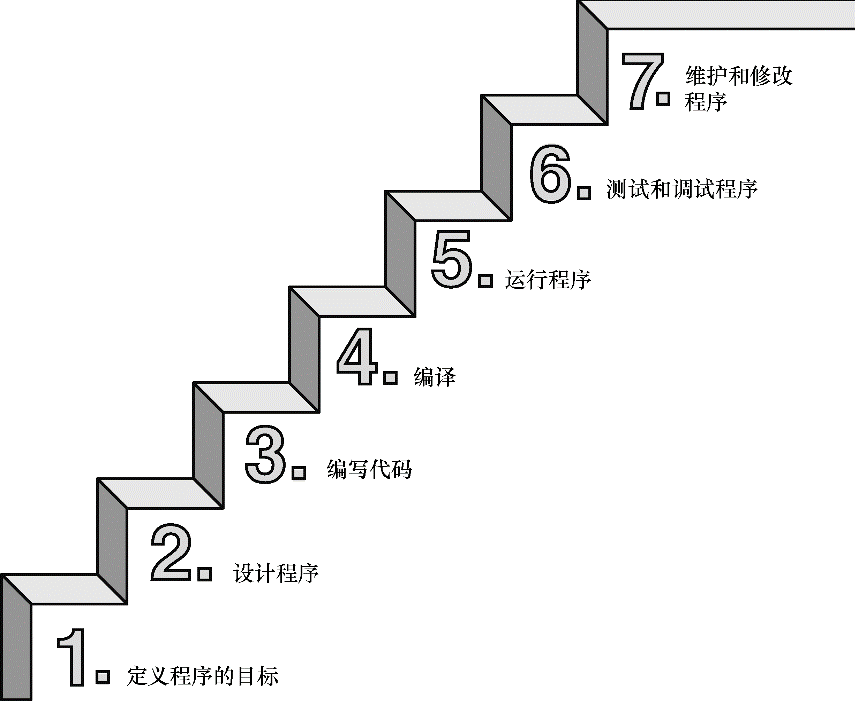
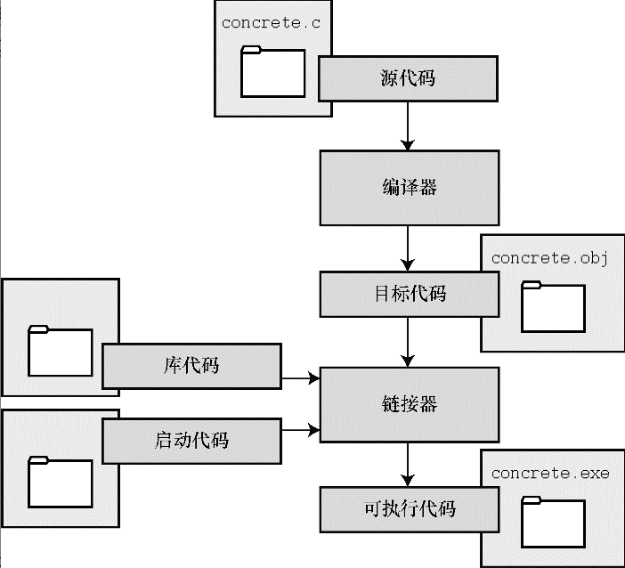

### 1.3 C语言的应用范围
面向对象编程是一门哲学，它通过对语言建模来适应问题，而不是对问题建模以适应语言。

### 1.4 计算机能做什么
现代的计算机由多种部件构成。中央处理单元（CPU）承担绝大部分的运算工作。随机存取内存（RAM）是存储程序和文件的工作区；而永久内存存储设备（过去一般指机械硬盘，现在还包括固态硬盘）即使在关闭计算机后，也不会丢失之前存储的程序和文件。另外，还有各种外围设备（如，键盘、鼠标、触摸屏、监视器）提供人与计算机之间的交互。

CPU有自己的小工作区——由若干个寄存器组成，每个寄存器都可以存储一个数字。一个寄存器存储下一条指令的内存地址，CPU使用该地址来获取和更新下一条指令。

### 1.7 使用C语言的7个步骤

### 1.8　编程机制
C编程的基本策略是，用程序把源代码文件转换为可执行文件（其中包含可直接运行的机器语言代码）。典型的C实现通过编译和链接两个步骤来完成这一过程。编译器把源代码转换成中间代码，链接器把中间代码和其他代码合并，生成可执行文件。C使用这种分而治之的方法方便对程序进行模块化，可以独立编译单独的模块，稍后再用链接器合并已编译的模块。

链接器的作用是，把你编写的目标代码、系统的标准启动代码和库代码这3部分合并成一个文件，即可执行文件。对于库代码，链接器只会把程序中要用到的库函数代码提取出来。

C是编译型语言。C编译器和链接器是把C语言源代码转换成可执行代码的程序。

一旦链接器生成了完整的可执行程序，就会将其删除。如果原始程序有多个源代码文件，则保留目标代码文件。