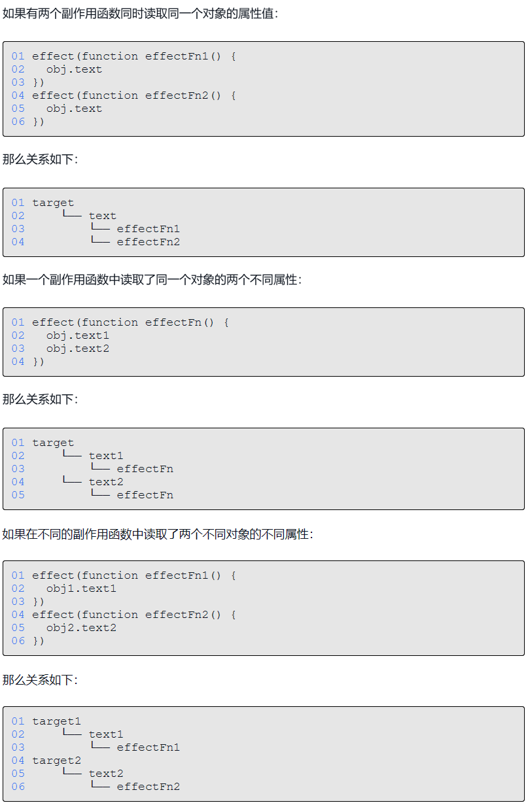
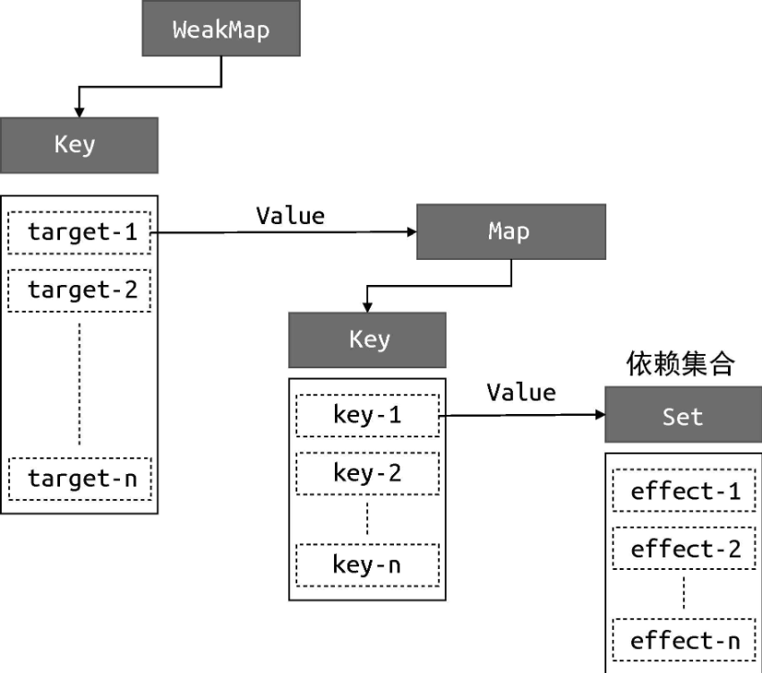

# 响应式数据与副作用函数
effect 函数的执行会直接或间接影响其他函数的执行，这时我们说 effect 函数产生了副作用
```js
// 全局变量
const obj = { text: 'hello world'};

function effect () {
  document.body.innerText = obj.text;  // 产生副作用
}
```
`obj.text = 'hello vue3'`

副作用函数 effect 会设置 body 元素的 innerText 属性，其值为 `obj.text`，当 obj.text 的值发生变化时，我们希望副作用函数 effect 会重新执行

# 响应式数据的基本实现

- 当副作用函数 effect 执行时，会触发字段 obj.text 的读取操作；
- 当修改 obj.text 的值时，会触发字段 obj.text 的设置操作。
- 
可以使用代理对象 Proxy 来实现
```js
const data = { text: 'hello world' };

const bucket = new Set();
let activeEffect; 

// 使用effect函数来注册副作用函数fn
function effect(fn) {
  activeEffect = fn;  // 记录当前的副作用函数
  fn();
}
effect(() => {
  document.body.innerText = obj.text;
})

setTimeout(() => {
  obj.text = 'hello vue3';
}, 1000)

const obj = new Proxy(data, {
  get(target, key) {
    // 将副作用函数添加到存储副作用函数的桶里
    if(activeEffect) {
      bucket.add(activeEffect);
    }
    return target[key];
  };

  set(target, key, newVal) {
    target[key] = newVal;
    // 把副作用函数从桶里取出来并执行
    bucket.foEach(fn => fn());
    return true // 代表操作成功
  };
})
```
无论操作 obj 的哪个字段都会触发 set 执行，重新执行副作用函数，即使这个副作用函数与这个字段之间不存在副作用关系；

使用一个 Set 数据结构作为存储副作用函数的“桶”。导致我们没有在副作用函数与被操作的目标字段之间建立明确的联系。

# 解决副作用函数与被操作的key之间没有联系的问题
一个副作用函数通常存在三个角色：
- 被操作（读取）的代理对象如 obj；
- 被操作（读取）的字段名如 text；
- 使用 effect 函数注册的副作用函数如 effectFn。

用 target 来表示一个代理对象所代理的原始对象，用 key 来表示被操作的字段名，用 effectFn 来表示被注册的副作用函数，那么这三个角色存在如下关系：

::: tip
    target____
              key____
                     effectFn
:::



::: tip
使用 WeakMap 代替 Set 作为桶的数据结构, WeakMap 经常用于存储那些只有当 key 所引用的对象存在时（没有被回收）才有价值的信息;
::: tip

WeakMap 由 target --> Map 构成；
 
Map 由 key --> Set 构成;

Set 中存储 target[key] 对应的副作用函数。 



具体代码如下：
```js
const bucket = new WeakMap();

const obj = new Proxy(data, {
  get(target, key) {
    track(target, key);
    return target[key]
  };
  
  set(target, key, newVal) {
    target[key] = newVal;
    trigger(target, key);
  };
})

function track(target, key) {
  if(!activeEffect) return;
  let depsMap = bucket.get(target);
  if(!depsMap) {
    depsMap = new Map();
    bucket.set(target, depsMap);
  }
  let deps = depsMap.get(key);
  if(!deps) {
    deps = new Set();
    depsMap.set(key, deps);
  }
  deps.add(activeEffect);
}

function trigger(target, key) {
  let depsMap = bucket.get(target);
  if(!depsMap) return;
  let effects = depsMap.get(key);
  effects && effects.forEach(fn => fn());
}
```
### 分支切换造成的遗留副作用函数

```js
const data = { ok: true, text: 'hello world' }

effect(function effectFn() { 
  document.body.innerText = obj.ok ? obj.text : 'hello vue3'
})
```
::: warn
上面的这段代码就是典型的分支切换问题，即当修改 `obj.ok = false` 时 `obj.text` 永远不会被访问到，那么理想情况应该是此时 `obj.text` 与 当前这个 effectFn 应当不存在副作用关系即 effectFn 不存在 `obj.text` 的依赖集合中，在 `obj.text` 的 trigger 阶段不应该执行这个 effectFn。但是目前的代码不会实现，依旧会执行 effectFn。
:::

主要问题出在此时副作用函数 effectFn 与响应式数据之间建立的联系是单向的，
只有响应式对象的属性通过依赖集合 Set 记录了其副作用函数，但是每个副作用函数并不知道自身影响了哪些属性，也就无法实现清除遗留过期的副作用函数。

:::tip
解决这个问题的思路很简单，每次副作用函数执行前，我们可以先把它从所有与之关联的依赖集合中删除，再去执行，这时候会触发 track 陷阱重新进行依赖收集，那么此时收集的副作用函数就都是最新的了。
:::

```js
let activeEffect;
function effect(fn) {
  effectFn(() => {
    cleanup(effectFn);   // 需要这个函数来先清除当前的副作用函数
    activeEffect = effectFn;
    fn()
  })
  effectFn();
  effectFn.deps = []  // 用来记录与该副作用函数相关联的依赖集合
}
```
在 track 函数中：
```js
function track(target, key) {
  if(!activeEffect) return;
  let depsMap = bucket.get(target);
  if(!depsMap) {
    depsMap = new Map();
    bucket.set(target, depsMap);
  }
  let deps = depsMap.get(key);
  if(!deps) {
    deps = new Set();
    depsMap.set(key, deps);
  }
  deps.add(activeEffect);

  // 将与 activeEffect 关联的依赖集合添加到其 deps 中方便后面清除副作用
  activeEffect.deps.push(deps);
}
```
通过实现 cleanup 函数实现对当前副作用函数的清除工作
```js
function cleanup(effectFn) {
  for(let i = 0; i < effectFn.deps.length; i++) {
    effectFn.deps[i].delete(effectFn);
  }
  // 将 effectFn.deps 置空
  effectFn.deps.length = 0;
}
```
到这里并没有完全解决问题，trigger 函数也要进行修改
```js
function trigger(target, key) {
  let depsMap = bucket.get(target);
  if(!depsMap) return;
  let effects = depsMap.get(key);
  effects && effects.forEach(fn => fn());
}
```
:::warn
再 trigger 函数中循环的遍历执行副作用函数又会重新触发依赖收集，在 trigger 函数内部，我们遍历 effects 集合，它是一个 Set 集合，里面存储着副作用函数。当副作用函数执行时，会调用 cleanup 进行清除，实际上就是从 effects 集合中将当前执行的副作用函数剔除，但是副作用函数的执行会导致其重新被收集到集合中，而此时对于 effects 集合的遍历仍在进行。

依赖集合遍历过程中一直在进行增删操作，不是纯函数遍历，副作用函数执行时先cleanup会从依赖集合中删掉自己这一项，然后执行fn又重新依赖收集把自身添加进当前遍历的依赖集合里了。
:::

修改如下：
```js
function trigger(target, key) {
  let depsMap = bucket.get(target);
  if(!depsMap) return;
  let effects = depsMap.get(key);
  const effectsToRun = new Set(effects)
  effectsToRun && effectsToRun.forEach(fn => fn());
}
```
:::tip
语言规范中对此有明确的说明：在调用 forEach 遍历 Set 集合时，如果一个值已经被访问过了，但该值被删除并重新添加到集合，如果此时 forEach 遍历没有结束，那么该值会重新被访问
:::
