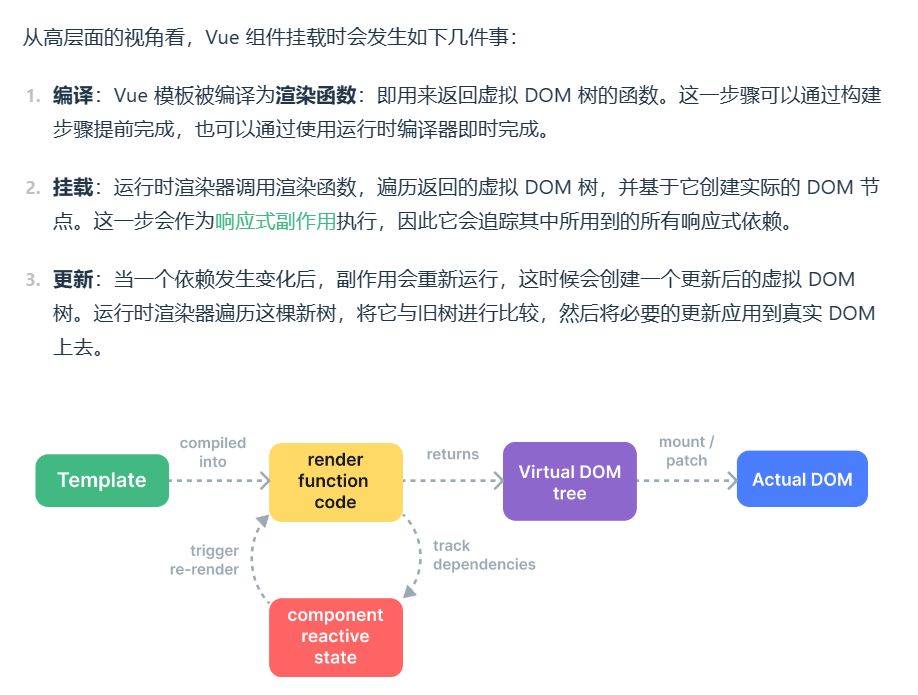

# 框架设计是权衡的艺术
在框架设计方面，差异体现在性能与可维护性之间的权衡。
## 命令式与声明式
命令式框架代表 `jQuery`，特点是关注过程；
```js
$('#app')
  .text('hello world')
  .on('click', () => console.log('You click me !'))
```
声明式框架代表 `Vue`，特点是关注结果，其在内部对命令式做了封装实现；
```html
<div @click="() => console.log('You click me !')">
  hello world !
</div>
```

声明式框架本身就是封装了命令式代码从而实现了面向用户的声明式，所以其性能不优于命令式代码的性能，但代码更加直观。

`声明式代码的更新性能效率 = 找出差异的性能消耗 + 直接修改的性能消耗`

由此可见只要尽可能减少 `找出差异的性能消耗` 声明式代码的性能就会无限接近于命令式代码的性能，虚拟DOM，就是为了最小化找出差异而出现的。

## 运行时与编译时
Vue.js 是一个编译时+运行时的框架，模板语法通过编译器编译成渲染函数，渲染函数会返回一个树形结构的js对象来表示DOM结构，即虚拟DOM，虚拟DOM最终通过渲染器执行命令式代码渲染为真正的DOM挂载至容器，在编译时和运行时都会进行一系列的优化来提高性能。



这是一个虚拟DOM
```js
const vnode = {
  tag: 'div',
  props: {
    onClick: () => alert('hello')
  },
  children: 'click me'
}
```
组件本质也是一组DOM元素的封装，可以是返回一个虚拟DOM的函数，也可以是一个拥有render方法的对象
```js
// 对象形式
const myComponent1 = {
  render() {
    return {
      tag: 'div',
      props: {
        onClick: () => alert('hello')
      },
      children: 'click me'
    }
  }
}

// 函数形式
const myComponent2 = function() {
  return {
    tag: 'div',
    props: {
      onClick: () => alert('hello')
    },
    children: 'click me'
  }
}
```
```js
const vnode = {
  tag: myComponent
}
renderer(vnode, document.body);
```

实现简单的渲染器功能
```js
function renderer(vnode, container) {
  if (typeof vnode.tag === 'string') {
    // 是一个标签元素
    mountElement(vnode, container);
  } else {
    mountComponent(vnode, container)
  }
}


// 挂载标签方法
function mountElement(vnode, container) {
  const el = document.createElement(vnode.tag);
  // 遍历 props 添加属性及事件
  for (const key in vnode.props) {
    if (/^on/.test(key)) {
      el.addEventListener(
        key.substr(2).toLowerCase(),
        vnode.props[key]
      )
    } else {
      el.setAttribute(key, vnode.props[key]);
    }
  }
  // 处理 children 子节点
  if (typeof vnode.children === 'string') {
    // 文本节点
    el.appendChild(document.createTextNode(vnode.children));
  } else if (Array.isArray(vnode.children)) {
    // 递归渲染子节点，挂载至 el
    vnode.children.forEach(child => renderer(child, el));
  }

  // 将最终的 el 挂载至 container
  container.appendChild(el);
}


// 挂载组件方法
function mountComponent(vnode, container) {
  let subtree;
  if (typeof vnode.tag === 'object') {
    subtree = vnode.render();
  } else if (typeof vnode.tag === 'function') {
    subtree = vnode.tag();
  }
  renderer(subtree, container)
}
```

## 模板的工作原理
编译器会将 Vue 模板编译成渲染函数

例如以下模板：
```html
<template>
  <div id="foo" :class="cls" @click="handler">
    click me
  </div>
</template>

<script>
  export default {
    data() {
      return {
        cls: 'bar'
      }
    },
    methods: {
      handler() {}
    }
  }
</script>
```
对于编译器来说，template模板就是一个字符串，它会分析该字符串并生成一个功能与之相同的渲染函数，编译器会把模板内容编译成渲染函数并添加到 `<script>` 标签的组件对象上，最终在浏览器运行的代码就是：
```js
export default {
  data() {
    return {
      cls: 'bar'
    }
  },
  methods: {
    handler() {}
  },
  render() {
    return {
      tag: 'div',
      props: {
        id: 'foo',
        class: this.data().cls,
        onClick: this.methods.handler
      },
      patchFlags: 1   // 假设 1 代表 class 是动态的
    }
  }
}
```
假设 `patchFlags: 1` 代表 ‘class 是动态的’，这样渲染器看到这个标志就知道只有 class 属性会发生改变，就相当于省去了寻找变更点的工作量，性能自然也就提升了。

> 渲染器的作用是把虚拟 DOM 对象渲染成真实的 DOM 元素，它的工作原理是递归的遍历虚拟 DOM 对象，并调用原生 DOM 的操作方法来完成真实 DOM 的创建。渲染器的精髓在于后续的更新，它会通过 Diff 算法找出变更点，并且只会更新需要更新的内容；
> 
> 渲染器在渲染组件时会先获取要渲染的内容，即执行组件的渲染函数并获得其返回值，也就是 `subtree`，最后递归地调用渲染器将 `subtree` 渲染出来即可。