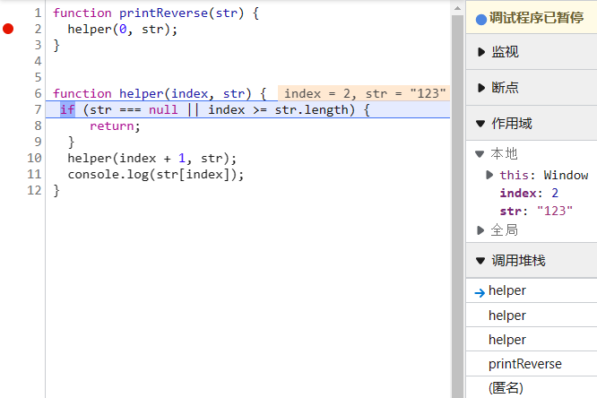

# 理解递归
> 递归是一种解决问题的有效方法，在递归过程中，函数将自身作为子例程调用。
递归的思想是把一个大型复杂问题层层转化为一个与原问题规模更小的问题，问题被拆解成子问题后，递归调用继续进行，
直到子问题无需进一步递归就可以解决的地步为止。

使用递归需要避免出现死循环，为了确保递归正确工作，递归程序应该包含2个属性：

- 基本情况（bottom cases），基本情况用于保证程序调用及时返回，不在继续递归，保证了程序可终止。
- 递推关系（recurrentce relation），可将所有其他情况拆分到基本案例。

# JS作用域与作用域链

每一个函数的执行上下文分别有`变量环境`和`词法环境`两部分
- `词法作用域`就是指作用域是由代码中函数声明的位置来决定的，所以`词法作用域`是静态的作用域，通过它就能够预测代码在执行过程中如何查找标识符。
- 函数内部通过var声明的变量，在编译阶段全都被存放到`变量环境`里面了。
- 通过let声明的变量，在编译阶段会被存放到`词法环境`中。
- 在每个执行上下文的变量环境中，都包含了一个外部引用，用来指向外部的执行上下文，把这个外部引用称为 outer。

当一段代码使用了一个变量时，JS引擎首先会在“当前的执行上下文”中查找该变量，如果在当前的变量环境中没有查找到，那么 JS引擎会继续在 outer 所指向的执行上下文中查找。

```js
function printReverse(str) {
  helper(0, str);
}

function helper(index, str) {
 if (str === null || index >= str.length) {
    return;
  }
  helper(index + 1, str);
  console.log(str[index]);
}

printReverse('123')
```

通过打断点查看代码执行情况：


> 调用栈中压入当前正在执行的函数 printReverse
> 本地作用域包含一个变量为 str = ’123‘，this 指向 window；

单步执行下一个函数调用：

> 进入函数 helper
> 调用栈中压入当前正在执行的函数 helper
> 本地作用域包含两个变量为 index = 0; str = ’123‘，this 指向 window；

单步执行下一个函数调用：

> 递归进入下一个函数 helper
> 调用栈中压入当前正在执行的函数 helper
> 本地作用域包含两个变量为 index = 1; str = ’123‘，this 指向 window；

单步执行下一个函数调用：

> 递归进入下一个函数 helper
> 调用栈中压入当前正在执行的函数 helper
> 本地作用域包含两个变量为 index = 2; str = ’123‘，this 指向 window；

单步执行下一个函数调用：

> 递归进入下一个函数 helper
> 调用栈中压入当前正在执行的函数 helper
> 本地作用域包含两个变量为 index = 3; str = ’123‘，this 指向 window；

单步执行下一个函数调用：

> 满足跳出条件，当前函数进行栈弹出
> 调用栈中弹出当前正在执行的函数最后一个 helper
> 本地作用域包含两个变量为 函数返回值 = undefined; str = ’123‘，this 指向 window；
> 打印 str[2] => '3'

单步执行下一个函数调用：

> 满足跳出条件，当前函数进行栈弹出
> 调用栈中弹出当前正在执行的函数 helper
> 本地作用域包含两个变量为 函数返回值 = undefined; str = ’123‘，this 指向 window；
> 打印 str[1] => '2'

单步执行下一个函数调用：

> 满足跳出条件，当前函数进行栈弹出
> 调用栈中弹出当前正在执行的函数 helper
> 本地作用域包含两个变量为 函数返回值 = undefined; str = ’123‘，this 指向 window；
> 打印 str[0] => '1'

单步执行下一个函数调用：

> printReverse 函数内的 helper 函数执行完毕
> 调用栈中弹出当前正在执行的函数 printReverse 内的 helper
> 本地作用域包含两个变量为 函数返回值 = undefined; str = ’123‘，this 指向 window；

单步执行下一个函数调用：

> printReverse 函数执行完毕
> 调用栈中弹出当前正在执行的函数 printReverse
> 局部作用域清空，只剩全局作用域；